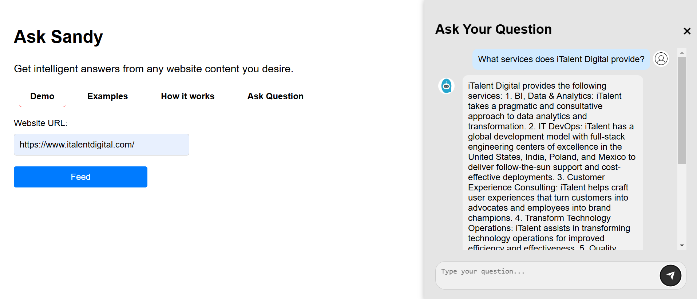

## Example

In this example, we’ll walk through how Ask AI can help you gather and interact with information from a website, using `https://www.italentdigital.com/` as an example.

### Step-by-Step Example

1. **Starting with the Website URL**

   - Enter `https://www.italentdigital.com/` in the **Website URL** field in Ask AI.
   - Press the **Feed** Button: Click on the Feed button to start data extraction.
   - This initiates the data extraction process, where Ask AI begins to gather content from the site.

2. **Data Crawling Progress**

   - When data crawling begins, you'll see a **progress notification**:
     - **25% Complete**: At this point, Ask AI has successfully begun crawling the content of `https://www.italentdigital.com/`. It continues retrieving relevant information from the website’s pages.

3. **Chunking and Storing Data in the Database**

   - As the process reaches **50%**, it indicates that the extracted data is now being chunked and vectorized. This allows the information to be stored efficiently for quick retrieval.

4. **Ask Questions**

   - When the progress bar shows **100% completion**, all the data is prepared, and you can now ask questions.
   - Navigate to the **Ask Question** tab and enter any questions you have. For example:
     - “What services does iTalent Digital provide?”
     - “What industries does iTalent Digital specialize in?”

   Ask AI will retrieve answers based on the stored content, allowing you to gain insights directly from the website's information.

---

This example demonstrates how Ask AI manages each step, making it easy to interact with and understand complex information from a website.
