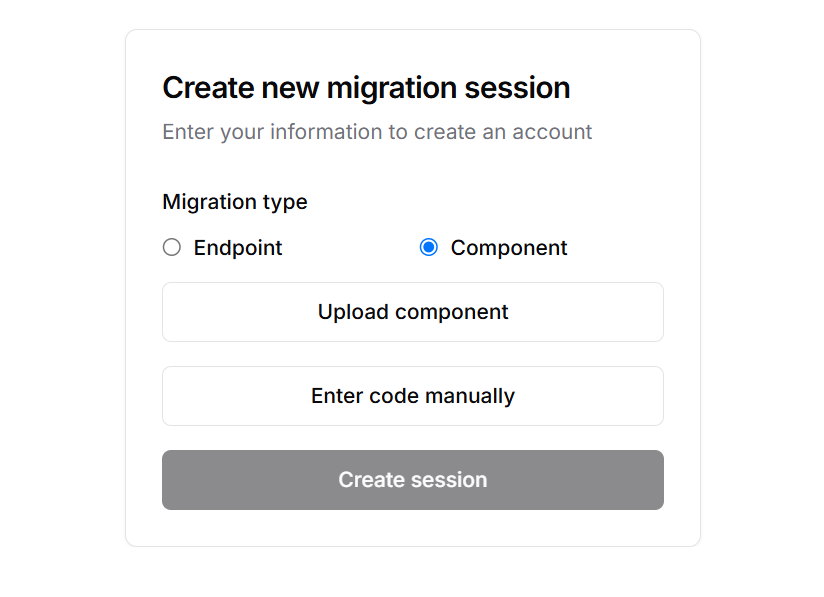
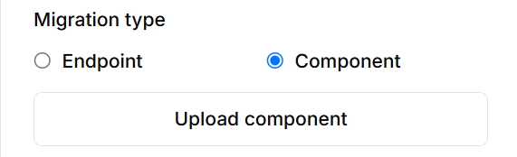
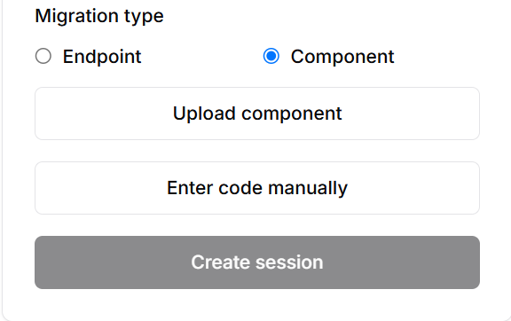
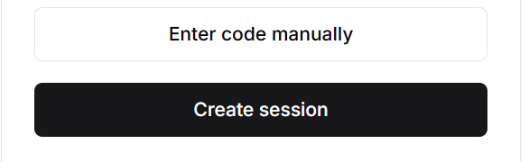
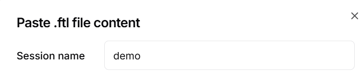
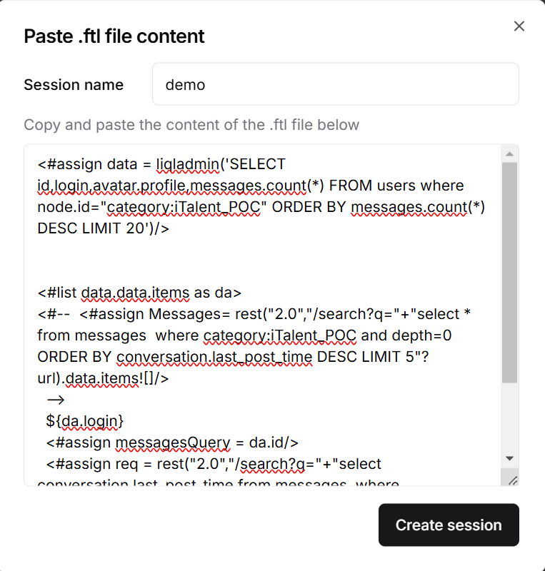

The **Component Code Generation** feature in Aurora Copilot offers two convenient methods for migrating your front-end components: file upload or manual code entry.

## How It Works

1. Click on the <b>Create New Session</b> key 

2. Choose your desired <b>Migration Type</b> 

  

    
Uploading a Component

    
Entering Code Manually

  

  

    
Upload component files directly into Aurora Copilot for migration:

    <ol>
      <li>Click the <b>Upload Component</b> button.</li>
       

          
      

      <li>Select the component file from your local machine.</li>
      <li>Click on <b>Create Session</b></li>
      

          
      

      <li>Aurora Copilot will automatically process and prepare the code for migration.</li>
    </ol>
  

  

    
Input the component code directly into Aurora Copilot:

    <ol>
      <li>Click the <strong>Enter Code Manually</strong> button to open the dialog box.</li>
      

          
      

      <li>Provide a <strong>Session Name</strong> for the migration.</li>
      

          
      

      <li>Paste or write your component code into the provided text area.</li>
       

          
      

      <li>Click <strong>Create Session</strong> to begin the migration process.</li>
    </ol>
  

<!-- ## Features of the Manual Entry Dialog

  

    
Session Name Field

    
Name and organize your migration sessions for easy reference.

  

  

    
Code Input Field

    
A spacious text area for pasting or writing your component code.

  

  

    
Submit Button

    
Initiate the migration process after entering your code.

  

 -->

  <h2>Pro Tip</h2>
  
For complex components with multiple files, consider using the file upload option to ensure all dependencies are included in the migration process.

