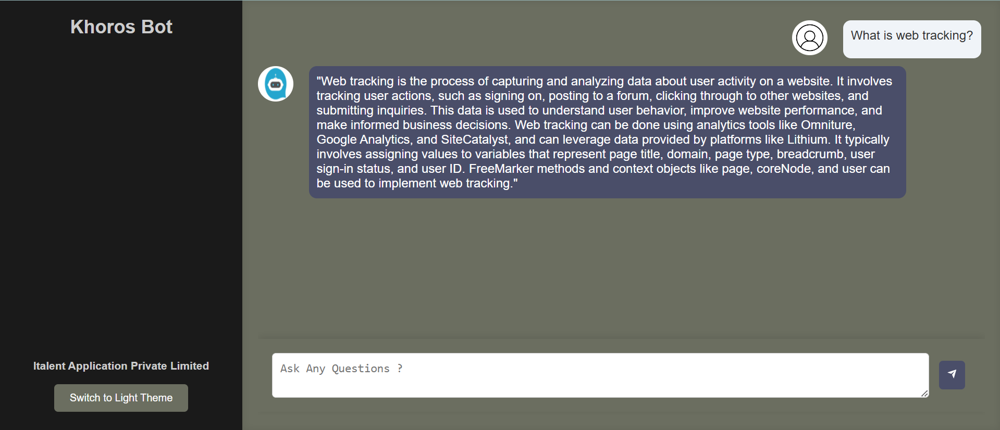

## Example Queries

Here are some examples of prompts you can use with the Khoros Docs Chat bot:

### Aurora Questions

- **How to create a new role in Aurora?**
- **How many ways are there to create or update your theme?**
- **How can we create a Handlebars component manually?**
- **What is the structure of queries in GraphQL in Aurora?**

### Classic Questions

- **Please provide the API v1 call for subscribing to a board.**
- **What is web tracking?**
- **What is a delegate?**
- **What LIQL query can I use for top-kudoed authors?**
- **What is a macro for error handling, and can you provide an example of it?**

The **Khoros** Docs Chat bot supports queries for both **Aurora** and **Classic APIs**, allowing users to get comprehensive documentation and assistance based on their specific needs.
