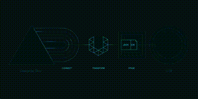

- PDF content is extracted and processed.
- Content is fed into the LLM chain.
- LLM analyzes text and generates structured labels.
- System prepares content for script generation.

    
    

        This GIF illustrates the content extraction process from PDF files, showing how the extracted text is fed into a language model for analysis and structured labeling. The automated system enhances script generation efficiency.
    

<!-- sakcjk -->
